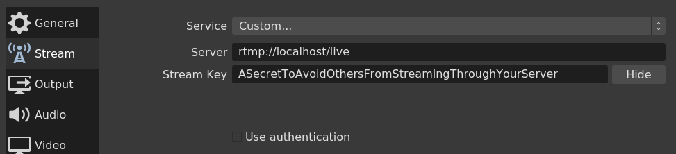
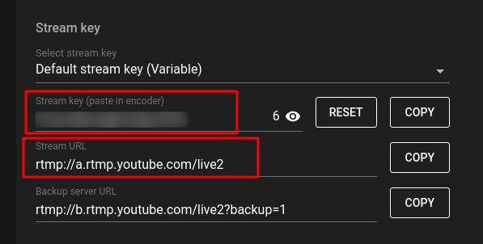
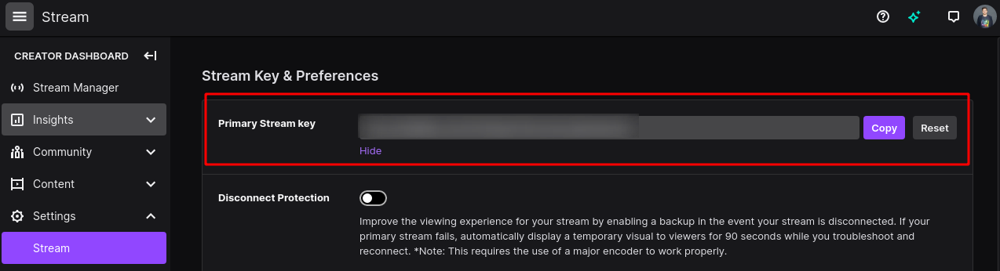
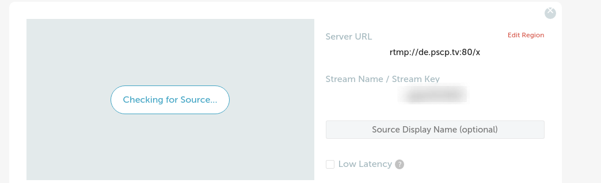

# RTMP Social Multicast Server

Want to stream to Twitch, Youtube, or Periscope at the same time? That's what this project allows you!

## Prerequisites

- Git
- Docker
- Docker Compose

## Getting Started

This guide will go through configuration and how to use it with OBS.
Make sure to have all the prerequisites installed on your machine.

1. Clone the repo

```bash
$ git clone https://github.com/HorusGoul/rtmp-social-multicast
```

2. Open the repo

```bash
$ cd rtmp-social-multicast
```

3. Create a `.env` file based on the `.env.template` file.

```bash
$ cp .env.template .env
```

4. Open and fill the `.env` file and fill it with the configuration for the platforms you want to stream.

    - [Configuring YouTube](#Configuring%20YouTube)
    - [Configuring Twitch](#Configuring%20Twitch)
    - [Configuring Periscope](#Configuring%20Periscope)

⚠️ &nbsp;**Make sure to use a strong `RTMP_SECRET` if you plan to expose the server to the internet.**

⚠️ &nbsp;**Avoid changing the `RTMP_AUTH_SERVER` variable unless you know what you're doing.**

5. Now let's launch everything with Docker Compose

```bash
$ docker-compose up
```

6. Time to stream! We'll use OBS in this guide, but other streaming software should support this configuration.



In the `Stream` configuration for OBS, select the `Custom...` service, then write `rtmp://localhost/live` into the `Server` field.

The `Stream Key` field corresponds with the `RTMP_SECRET` you defined in the `.env` file, so make sure it's the same, or you won't be able to start your streaming session.

**All set! Let's go live 🔴**

_If YouTube isn't receiving data from us, that means something went wrong in the process. Recheck everything or open an issue if you can't get it to work following these steps._

---

## Configuring YouTube

_Here is stated how you can get the parameters to fill the **YouTube** section of your `.env` file._

Go to https://youtube.com/livestreaming, and there you'll find this:



`Stream Key` corresponds with `RTMP_YOUTUBE_KEY`.
`Stream URL` corresponds with `RTMP_YOUTUBE_SERVER`. **Make sure to add a slash (`/`) at the end of the URL if it doesn't have one**.

⚠️ &nbsp;**Remember setting the `RTMP_YOUTUBE_ENABLED` to `true`**

---

## Configuring Twitch

_Here is stated how you can get the parameters to fill the **Twitch** section of your `.env` file._

Go to your Twitch Dashboard following this link: https://dashboard.twitch.tv/settings/stream.
There you'll find your `Primary Stream Key`. We should place it
in the **`RTMP_TWITCH_KEY`** variable.



Now you need to get the closest server to your location, for that,
Twitch provides this website https://stream.twitch.tv/ingests/.


Once you pick the best server for you, copy the `rtmp://live-mad.twitch.tv/app/`
part of the URI, that's the value we'll use for the **`RTMP_TWITCH_SERVER`**.
**Don't copy the `{stream_key}` part, or it won't work.**

⚠️ &nbsp;**Remember setting the `RTMP_TWITCH_ENABLED` to `true`**

---

## Configuring Periscope

_Here is stated how you can get the parameters to fill the **Periscope** section of your `.env` file._

Go to the Periscope Producer Page following this link: https://www.periscope.tv/account/producer.
There you'll find your `Stream Key`. We should place it
in the **`RTMP_PERISCOPE_KEY`** variable.

We can also find the `Server URL` that we should place in the **`RTMP_PERISCOPE_SERVER`** variable. **Make sure to add a slash (`/`) at the end of the URL if it doesn't have one**.



⚠️ &nbsp;**Remember setting the `RTMP_PERISCOPE_ENABLED` to `true`**

---

## Support me

Feel free to buy me a coffee if you enjoy my content 😄

<a href="https://www.buymeacoffee.com/horus" target="_blank"></a>
